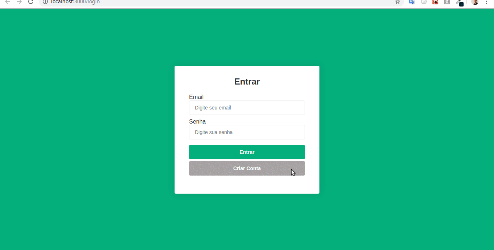

# Product Store Frontend

This project was developed using reactjs and apollo to add, list and search products.

## Prerequisites

Node 8.10.0 or later on your local development machine

## Installing

* First you need to have the [backend](https://github.com/davir8/store-backend) running;
* After that you should clone this repository on your machine with the `git clone https://github.com/davir8/store-frontend`;
* Go to the project directory with the `cd store-frontend` command;
* After that install the project dependencies using `npm install` or` yarn install`;
* Now run the project using `npm start` or `yarn start`;

if all went well, the project will be available at: http://localhost:3000/ `

## Functionalities

* User authentication
* Product creation
* Product listing with infinite scroll
* Product details

## License

This project is licensed under the MIT License - see the [LICENSE.md](LICENSE.md) file for details
